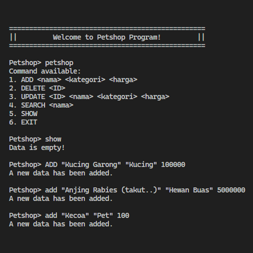

# Janji
_Saya Datuk Daneswara Raditya Samsura dengan NIM 2308224 mengerjakan Latihan Modul 1 pada Mata Kuliah Desain dan Pemrograman Berorientasi Objek (DPBO) untuk keberkahan-Nya maka saya tidak melakukan kecurangan seperti yang telah dispesifikasikan. Aamiin_

# Dokumentasi

    
    
    

